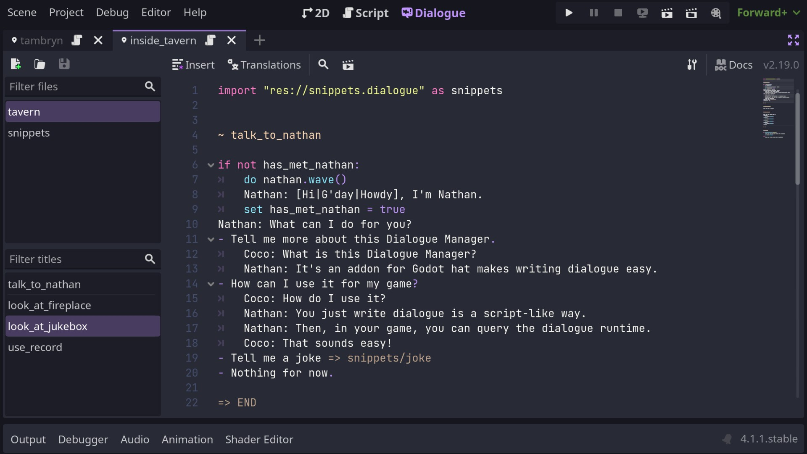
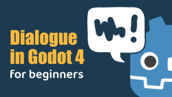
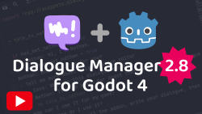
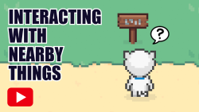
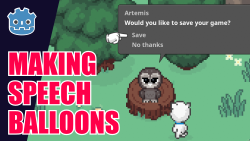

# Dialogue Manager _for Godot 4_

Dialogue Manager is an addon for [Godot 4](https://godotengine.org/) (there's a [Godot 3 version too](https://github.com/nathanhoad/godot_dialogue_manager/tree/v1.x)) that provides a stateless branching dialogue editor and runtime. Write your dialogue in a script-like way and easily integrate it into your game.

You can install it via the Asset Library or [downloading a copy](https://github.com/nathanhoad/godot_dialogue_manager/archive/refs/heads/main.zip) from GitHub.

 

## Documentation

- [FAQ](docs/FAQ.md)
- [Writing Dialogue](docs/Writing_Dialogue.md)
- [Settings](docs/Settings.md)
- [Using dialogue in your game](docs/Using_Dialogue.md)
- [Example balloons](docs/Example_Balloons.md)
- [Translations](docs/Translations.md)
- [API](docs/API.md)
- [C# wrapper](docs/CSharp.md)

## Video Guides

## Contributors

Dialogue Manager is made by [Nathan Hoad](https://nathanhoad.net) with help from [these cool people](https://github.com/nathanhoad/godot_dialogue_manager/graphs/contributors).

## License

Licensed under the MIT license, see `LICENSE` for more information.
