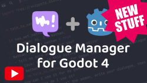

A stateless branching dialogue manager for the [Godot Game Engine](https://godotengine.org/). 

Write your dialogue in a simple script-like way and run it in your game.

## Installation

1. Clone or download a copy of this repository.
2. Copy the contents of `addons/dialogue_manager` into your `res://addons/dialogue_manager` directory.
3. Enable `Dialogue Manager` in your project plugins.

## Documentation

- [Writing Dialogue](docs/Writing_Dialogue.md)
- [Editor and Runtime settings](docs/Settings.md)
- [Using dialogue in your game](docs/Using_Dialogue.md)
- [Translations](docs/Translations.md)

## Discord

## Tutorials

## Contributors

Godot Dialogue Manager is made by [Nathan Hoad](https://nathanhoad.net) with help from [these cool people](https://github.com/nathanhoad/godot_dialogue_manager/graphs/contributors).

## License

Licensed under the MIT license, see `LICENSE` for more information.
