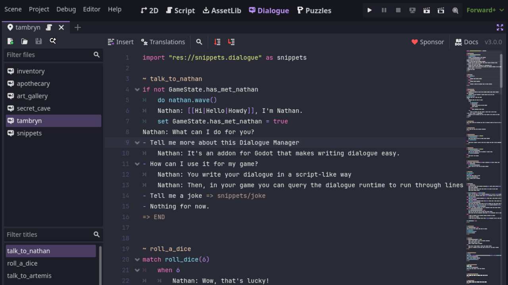
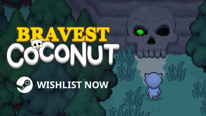

# Dialogue Manager _for Godot 4.4+_

Dialogue Manager is an addon for [Godot 4.4+](https://godotengine.org/) that provides a stateless branching dialogue editor and runtime. Write your dialogue in a script-like way and easily integrate it into your game.

You can install it via the Asset Library or [downloading a copy](https://github.com/nathanhoad/godot_dialogue_manager/archive/refs/heads/main.zip) from GitHub.

 

## Documentation

- [FAQ](docs/FAQ.md)
- [Basic Dialogue](docs/Basic_Dialogue.md)
- [Conditions and Mutations](docs/Conditions_Mutations.md)
- [Settings](docs/Settings.md)
- [Using dialogue in your game](docs/Using_Dialogue.md)
- [Example balloons](docs/Example_Balloons.md)
- [Translations](docs/Translations.md)
- [API](docs/API.md)
- [C# wrapper](docs/CSharp.md)
- [Upgrading from v2 to v3](docs/2to3.md)

## Example Projects

## Wishlist my game

## Video Guides

## Older versions of Dialogue Manager

- [Dialogue Manager v3.3](https://github.com/nathanhoad/godot_dialogue_manager/releases/tag/v3.3.3) for Godot 4.3
- [Dialogue Manager v2.x](https://github.com/nathanhoad/godot_dialogue_manager/tree/v2.x) for Godot <=4.3
- [Dialogue Manager v1.x](https://github.com/nathanhoad/godot_dialogue_manager/tree/v1.x) for Godot 3

## Contributors

Dialogue Manager is made by [Nathan Hoad](https://nathanhoad.net) with help from [these cool people](https://github.com/nathanhoad/godot_dialogue_manager/graphs/contributors).

## License

Licensed under the MIT license, see `LICENSE` for more information.
