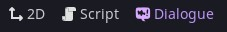
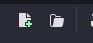

# Basic Dialogue

Navigate to the "Dialogue" tab in the editor.



Open some dialogue by clicking the "new dialogue file" button or "open dialogue" button.



The most basic dialogue is just a string:

```
This is some dialogue.
```

If you want to add a character that's doing the talking then include a name before a colon and then the dialogue:

```
Nathan: This is me talking.
```

You can add some spice to your dialogue with [BBCode](https://docs.godotengine.org/en/stable/tutorials/ui/bbcode_in_richtextlabel.html#reference). Along with everything available to Godot's `RichTextLabel` you can also use a few extra ones provided by Dialogue Manager:

- `[[This|Or this|Or even this]]` to pick one option at random in the middle of dialogue (note the double "[[").
- `[wait=N]` where N is the number of seconds to pause typing of dialogue. You can also wait for actions by writing something like `[wait="ui_accept"]`, where "ui_accept" is written as a string (you can *also* wait for any of a list of actions with something like `[wait=["ui_accept","ui_cancel"]]` or to just wait for any action at all, `[wait]`).
- `[speed=N]` where N is a number to multiply the default typing speed by.
- `[next=N]` where N is a number of seconds to wait before automatically continuing to the next line of dialogue. You can also use `[next=auto]` to have the label determine a length of time to wait based on the length of the text.

Lines of dialogue are written one after another:

```
Nathan: I'll say this first.
Nathan: Then I'll say this line.
```

To add some interactivity to the dialogue you can specify responses. Responses are lines that begin with a `- `:

```
- This is a response
- This is a different response
- And this is the last one
```

## Responses

One way of branching the dialogue after a response is to nest some more dialogue below each response. Nested response dialogue can nest indefinitely as more and more branches get added

```
Nathan: How many projects have you started and not finished?
- Just a couple
	Nathan: That's not so bad.
- A lot
	Nathan: Maybe you should finish one before starting another one.
- I always finish my projects
	Nathan: That's great!
	Nathan: ...but how many is that?
	- A few
		Nathan: That's great!
	- I haven't actually started any
		Nathan: That's what I thought.
```

Responses can include conditions that determine if they are selectable. To include a condition in a response, add a condition expression wrapped in square brackets, like this:

```
- This is a normal response
- This is a conditional response [if SomeGlobal.some_property == true]
```

## Randomising lines of dialogue

If you want to pick a random line out of multiple, you can mark the lines with a `%` at the start like this:

```
Nathan: I will say this.
% Nathan: And then I might say this
% Nathan: Or maybe this
% Nathan: Or even this?
```

Each line will have an equal chance of being said.

To weight lines, use a `%` followed by a number to weight by. For example, a `%2` will mean that line has twice the chance of being picked as a normal line.

```
%3 Nathan: This line has a 60% chance of being picked
%2 Nathan: This line has a 40% chance of being picked
```

To separate multiple groups of random lines, use an empty line:

```
% Group 1
% Also group 1

% Group 2
% And this is also group 2
```

You can also have whole blocks be random:

```
%
	Nathan: This is the first block.
	Nathan: Still the first block.
% Nathan: This is the possible outcome.
```

If the first random item is chosen it will play through both nested lines.

## Variables in dialogue

To show some value of game state within a line of dialogue, wrap it in double curlies.

```
Nathan: The value of some property is {{SomeGlobal.some_property}}.
```

Similarly, if the name of a character is based on a variable you can provide it in double curlies too:

```
{{SomeGlobal.some_character_name}}: My name was provided by the player.
```

## Tags

If you need to annotate your lines with tags, you can wrap them in `[#` and `]`, separated by commas. So to specify "happy" and "surprised" tags for a line, you would do something like:

```
Nathan: [#happy, #surprised] Oh, Hello!
```

At runtime, the `DialogueLine`'s `tags` property would include `["happy", "surprised"]`.

You can also give tags values that can be accessed with the `get_tag_value` method on a `DialogueLine`:

```
Nathan: [#mood=happy] Oh, Hello!
```

For this line of dialogue, the `tags` array would be `["mood=happy"]`, and `line.get_tag_value("mood")` would return `"happy"`.

## Simultaneous dialogue

If you would like multiple characters to speak at once the you can use the concurrent lines syntax. After a regular line of dialogue any lines that are to be spoken at the same time as it can be prefixed with "| ".

```
Nathan: This is a regular line of dialogue.
| Coco: And I'll say this line at the same time!
| Lilly: And I'll say this too!
```

To use concurrent line, access the `concurrent_lines` property on a `DialogueLine`.

_NOTE: In an effort to keeps things simple, the built-in example balloon does not contain an implementation for concurrent lines._

## Titles and Jumps

Titles are markers within your dialogue that you can start from and jump to. Usually, in your game you would start some dialogue by providing a title (the default title is `start` but it could be whatever you've written in your dialogue).

Titles start with a `~ ` and are named (without any spaces):

```
~ this_is_a_title
```

To jump to a title from somewhere in dialogue you can use a jump/goto line. Jump lines are prefixed with a `=> ` and then specify the title to go to.

```
=> this_is_a_title
```

When the dialogue runtime encounters a jump it will then direct the flow to that title marker and continue from there.

If you want to end the flow from within the dialogue you can jump to `END`:

```
=> END
```

This will end the current flow of dialogue.

You can also use a "jump and return" kind of jump that redirects the flow of dialogue and then returns to where it jumped from. Those lines are prefixed with `=>< ` and then specify the title to jump to. Once the flow encounters an `END` (or the end of the file) flow will return to where it jumped from and continue from there.

If you want to force the end of the conversation regardless of any chained "jump and returns", you can use an `=> END!` line.

Jumps can also be used inline for responses:

```
~ start
Nathan: Well?
- First one
- Another one => another_title
- Start again => start
=> END

~ another_title
Nathan: Another one?
=> END
```

### Expression Jumps

You can use expressions as jump directives. The expression needs to resolve to a known title name or results will be unexpected.

**Use these with caution** as the dialogue compiler can't verify expression values match any titles at compile time.

Expression jumps look something like:

`=> {{SomeGlobal.some_property}}`

## Importing dialogue into other dialogue

If you have a dialogue file that contains common dialogue that you want to use in multiple other files you can `import` it into those files.

For example, we can have a `snippets.dialogue` file:

```
~ banter
Nathan: Blah blah blah.
=> END
```

Which we can then import into another dialogue file and jump to the `banter` title from the snippets file (note the `=><` syntax which denotes to return to this line after the jumped dialogue finishes):

```
import "res://snippets.dialogue" as snippets

~ start
Nathan: The next line will be from the snippets file:
=>< snippets/banter
Nathan: That was some banter!
=> END
```

## Conditions & Mutations

See [Conditions & Mutations](./Conditions_Mutations.md).

## Translations

See [Translations](./Translations.md).