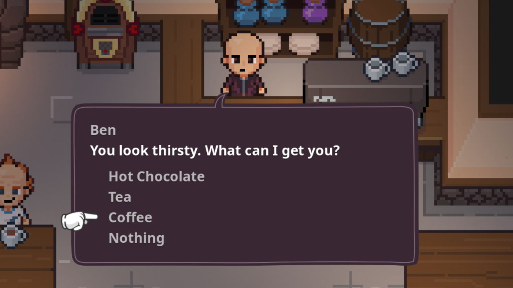

# Example Balloons

It's up to you to implement the actual dialogue rendering and input control. There are a few example projects available on my [Itch.io page](https://nathanhoad.itch.io) that demonstrate some of what is possible.

There is also an _example balloon_ that is provided by Dialogue Manager to help get you started on building your own.

## Copying the example balloon

There is a "Create copy of example dialogue balloon..." item in the _Project > Tools_ menu. When you click it, you will be prompted to choose a directory to save the copied files into. From there, you can edit the new balloon to make it your own.

The most common thing you might want to do is adjust the font and margin sizes. The simplest way to do that is to edit the `theme` that is attached to the `Balloon` panel in your new copy of the example balloon.

## Using a balloon

You have a few options for using your balloon. If using the example balloon (or your balloon has a similar implementation) you can:

- Call the balloon via code, for example: `DialogueManager.show_dialogue_balloon(load("res://some/dialogue/file.dialogue), "start")`
- Call a balloon via code (if you have more than one): `DialogueManager.show_dialogue_balloon_scene("res://path/to/balloon.tscn", load("res://some/dialogue/file.dialogue), "start")`
- Add the balloon to your scene and provide a dialogue resource and starting label in the inspector. Then you can either enable "auto start" or start the balloon from code by calling `start()` on a reference to the balloon.

You can also write a totally custom method for instantiating and showing your balloon. This is the most flexible option. 

For example, this is what I have in my game, [Bravest Coconut](https://bravestcoconut.com):

  
_With a bit of extra code, balloons can follow characters._
