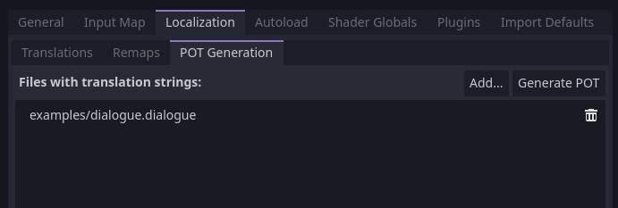

# Translations

By default, all dialogue and response prompts will be run through Godot's `tr` function to provide translations.

Translations in dialogue work slightly differently depending on whether you're using CSV files or PO files to define your translated phrases.

By default, Dialogue Manager will try to guess which one you're using based on the files that you have set up in the locale project settings. If a PO file is found, it will assume you're using PO files. If not, it will fall back to assuming CSV.

You can override this behaviour by setting `DialogueManager.translation_source` to be one of the values provided by `DialogueManager.TranslationSource`. `None` will turn off translations altogether, meaning you'll have to handle them yourself. `CSV` tells Dialogue Manager that you're using CSVs for translations. `PO` tells it that you're using PO files for translations. `Guess` is the default behaviour and will attempt to guess either CSV or PO.

## Static translation keys in dialogue

Dialogue lines and response lines can specify a unique ID per line in the form of `[ID:SOME_KEY]` where "SOME_KEY" is a unique string identifying that line/response.

For example:

```
Nathan: Hi! I'm Nathan. [ID:HI_IM_NATHAN]
Coco: Meow. [ID:MEOW]
```

Static line keys are useful if you need to match up lines with voice acted dialogue.

_NOTE: Runtime tags/bbcode (eg. `[next=auto]`, `[wave]`, etc) are part of the dialogue line so they should be included in any translations._

## Generating POT files for gettext (PO) translation

All `.dialogue` files are automatically added to the POT Generation list in **Project Settings > Localization** for them to be included in the general PO template.



_NOTE: If static translation keys are present in lines of dialogue that key will be used as POT context for that line, and the dialogue itself will be the actual POT key._


## Adding notes for translators

Having context is essential for future translators. As you may know, in gettext files the lines starting with `#. TRANSLATORS:` serve as notes for translators. To achieve this behaviour you can add a line starting with `##` before your dialogue line, this will end up as a special comment for translators in your `POT` and `PO` files.

_NOTE: This behaviour is impemented by Godot itself_

```
## This is the first time that Nathan meets Coco
Nathan: Hi! I'm Nathan. [ID:HI_IM_NATHAN]
Coco: Moew. [ID:MEOW]
```

```
#. TRANSLATORS: This is the first time that Nathan meets Coco
#: [path to the dialogue file]nathan_meets_coco.dialogue
msgctxt "HI_IM_NATHAN"
msgid "Hi! I'm Nathan."
```


## Exporting lines as CSV

You can export translations as CSV from the "Translations" menu in the dialogue editor.

This will find any unique dialogue lines or response prompts and add them to a list. If an ID is specified for the line (e.g. `[ID:SOME_KEY]`) then that will be used as the translation key, otherwise the dialogue/prompt itself will be.

If the target CSV file already exists, it will be merged with.

## Importing changes to translations CSV

If you've made changes in the exported CSV to the original lines, you can reimport them from the translations menu.

This will match lines using static keys and replace the dialogue/response content with the text found in the CSV.

## Translating character names

Characters' names generally show up in more than just dialogue, so it is assumed that they are translated by your game. There is an option to export all character names in a dialogue file to CSV from the Translations menu.

Character names will also be added to the POT Generation list with a context of "dialogue".
