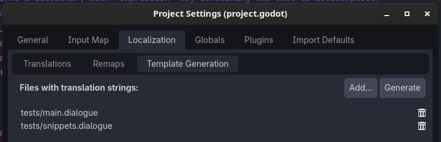

# Translations

By default, all dialogue and response prompts will be run through Godot's `tr` function to provide translations.

Translations in dialogue work slightly differently depending on whether you're using CSV files or PO files to define your translated phrases.

By default, Dialogue Manager will try to guess which one you're using based on the files that you have set up in the locale project settings. If a PO file is found, it will assume you're using PO files. If not, it will fall back to assuming CSV.

You can override this behaviour by setting `DialogueManager.translation_source` to be one of the values provided by `DialogueManager.TranslationSource`. `None` will turn off translations altogether, meaning you'll have to handle them yourself. `CSV` tells Dialogue Manager that you're using CSVs for translations. `PO` tells it that you're using PO files for translations. `Guess` is the default behaviour and will attempt to guess either CSV or PO.

## Static line IDs in dialogue

Dialogue lines and response lines can specify a unique ID per line in the form of `[ID:SOME_KEY]` where "SOME_KEY" is a unique string identifying that line/response.

For example:

```
Nathan: Hi! I'm Nathan. [ID:HI_IM_NATHAN]
Coco: Meow. [ID:MEOW]
```

Static line IDs are useful if you need to match up lines with voice acted dialogue.

> [!IMPORTANT]
> Runtime tags/bbcode (eg. `[next=auto]`, `[wave]`, etc) are part of the dialogue line so they should be included in any translations._

## Generating a POT/gettext or CSV file for translation

All `.dialogue` files are automatically added to the Template Generation list in **Project Settings > Localization** for them to be included in the general translation export.



> [!NOTE]
> If static line IDs are present in lines of dialogue that key will be used as POT context for that line, and the dialogue itself will be the actual POT key._

From here you can export as either a PO Template for gettext or as a CSV. 

## Adding notes for translators

Having context is essential for future translators. As you may know, in gettext files the lines starting with `#. TRANSLATORS:` serve as notes for translators. To achieve this behaviour you can add a line starting with `##` before your dialogue line, this will end up as a special comment for translators in your `POT` and `PO` files.

_NOTE: This behaviour is impemented by Godot itself_

```
## This is the first time that Nathan meets Coco
Nathan: Hi! I'm Nathan. [ID:HI_IM_NATHAN]
Coco: Moew. [ID:MEOW]
```

```
#. TRANSLATORS: This is the first time that Nathan meets Coco
#: [path to the dialogue file]nathan_meets_coco.dialogue
msgctxt "HI_IM_NATHAN"
msgid "Hi! I'm Nathan."
```

