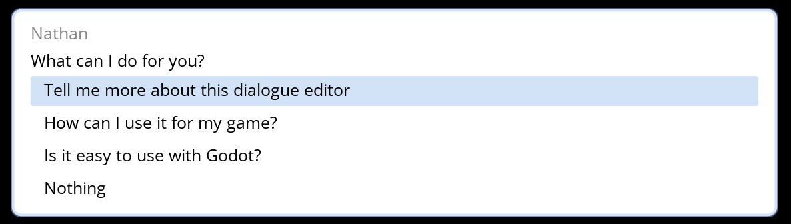
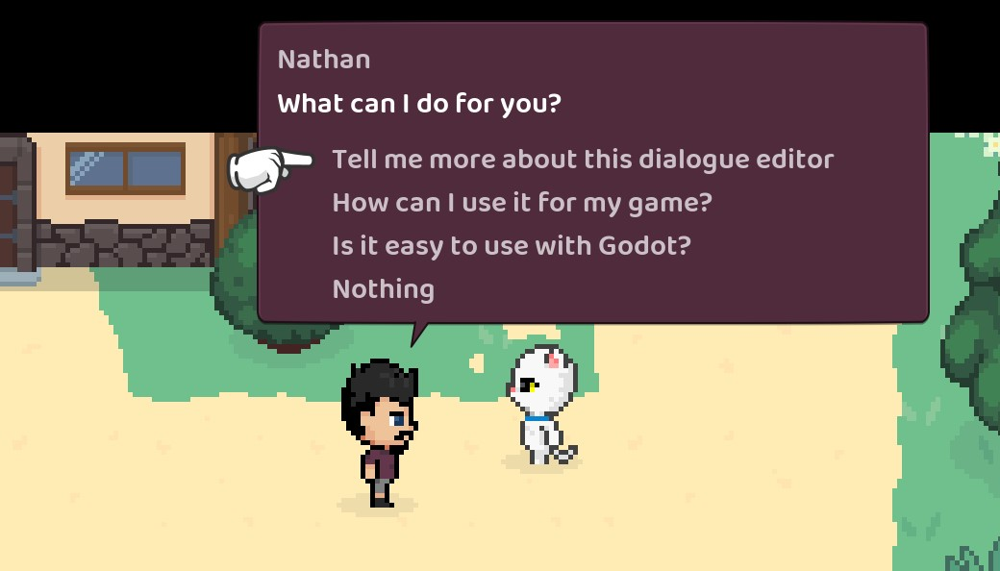

# Using dialogue in your game

A global called `DialogueManager` is available to provide lines of dialogue.

If you haven't specified your game states mentioned above you can manually set them with something like:

```gdscript
# Game state objects are globals that have properties and methods used by your dialogue
DialogueManager.game_states = [GameState, SessionState]
```

Then you can get a line of dialogue by yielding to `get_next_dialogue_line` and providing a node title.

So, assuming your dialogue file was `res://assets/dialogue/example.tres` and you had a node title in there of `~ Some node title` then you could do this to get the first printable dialogue:

```gdscript
var dialogue_resource = preload("res://assets/dialogue/example.tres")
var dialogue_line = yield(DialogueManager.get_next_dialogue_line("Some node title", dialogue_resource), "completed")
```

This will find the line with the given title and then begin checking conditions and stepping over each line in the `next_id` sequence until we hit a line of dialogue that can be displayed (or the end of the conversation). Any mutations found along the way will be exectued as well.

You need to `yield` this call because it can't gaurantee an immediate return. If there are any mutations it will need to allow for them to run before finding the next line.

The returned line in dialogue is a `DialogueLine` and will have the following properties:

- **character**: String
- **dialogue**: String
- **replacements**: Dictionary of { text => expression } (expression is in AST format and can be manually resolved with `DialogueManager.replace_values()`)
- **pauses**: Dictionary of { index => time }
- **speeds**: Array of [index, speed]
- **inline_mutations**: Array of [index, expression] (expression is in AST format and which can be manually resolved with `DialogueManager.mutate()`)
- **next_id**: String
- **responses**: Array of DialogueResponse:
  - **prompt**: String
  - **next_id**: String

Now that you have a line of dialogue you can find the next line after it with:

```gdscript
# If this line has no responses we can just use "next_id". If it does have responses you can use
# the "next_id" of whichever response was chosen
dialogue_line = yield(DialogueManager.get_next_dialogue_line(dialogue_line.next_id, dialogue_resource), "completed")
```

It's up to you to implement the actual dialogue rendering and input control but there are a couple of things included to get you started: `DialogueLabel` and the **Example Balloon**.

## DialogueLabel node

The addon provides a `DialogueLabel` node (an extension of the RichTextLabel node) which helps with rendering a line of dialogue text. 

This node is given a `DialogueLine` object (mentioned above) and uses its properties to work out how to handling typing out the dialogue. It will automatically handle any `bb_code`, `wait`, `speed`, and `inline_mutation` references.

Use `type_out()` to start typing out the text. The label will emit a `finished` signal when it has finished typing.

The label will emit a `paused` signal (along with the duration of the pause) when there is a pause in the typing and a `spoke` signal (along with the letter typed and the current speed) when a letter was just typed.

## Example balloon

There is an example implementation of a dialogue balloon you can use to get started (it's the same balloon that gets used when you run the test scene from the dialogue editor).

Have a look at [/addons/dialogue_manager/example_balloon](../addons/dialogue_manager/example_balloon) to see how it's put together.

You can give the balloon a go in your game by doing something like this:

```gdscript
var dialogue_resource = preload("res://assets/dialogue/example.tres")
DialogueManager.show_example_dialogue_balloon("Some title", dialogue_resource)
```

This will add a CanvasLayer and some UI to the bottom of the screen for an interactive dialogue balloon. Input is mapped to `ui_up`, `ui_down`, and `ui_accept`.



Make a copy of the example balloon directory to start customising it to fit your own game.

Once you have your own balloon scene you can do something like this (This is what I have in my game):

```gdscript
# Start some dialogue from a title, then recursively step through further lines
func show_dialogue(title: String, resource: DialogueResource) -> void:
	var dialogue = yield(DialogueManager.get_next_dialogue_line(title, resource), "completed")
	if dialogue != null:
		var balloon := DialogueBalloon.instance()
		balloon.dialogue = dialogue
		add_child(balloon)
		# Dialogue might have response options so we have to wait and see
		# what the player chose. "actioned" is emitted and passes the "next_id"
		# once the player has made their choice.
		show_dialogue(yield(balloon, "actioned"), resource)
```




## Conditions

Conditions let you optionally show dialogue or response options.

If you have a condition in the dialogue editor like `if some_variable == 1` or `if some_other_variable` then you need to have a matching property on one of the given `game_state`s or the current scene.

If you have a condition like `if has_item("rubber_chicken")` then you will need a method on one of the `game_state`s or the current scene that matches the signature `func has_item(thing: String) -> bool:` (where the argument `thing` can be called whatever you want, as long as the type matches or is untyped). The method will be given `"rubber_chicken"` as that argument).

## Mutations

Mutations are for updating game state or running sequences (or both).

If you have a mutation in the dialogue editor like `do some_variable = 1` then you will need a matching property on one of your `game_state`s or the current scene.

If you have a mutation like `do animate("Character", "cheer")` then you will need a method on one of the `game_state`s or the current scene that matches the signature `func animate(character: String, animation: String) -> void:`. The argument `character` will be given `"Character"` and `animation` will be given `"cheer"`.