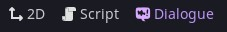
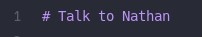
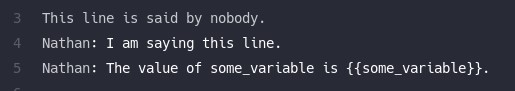
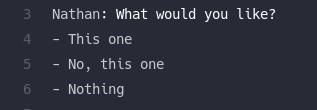
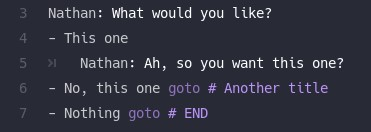
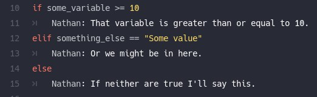
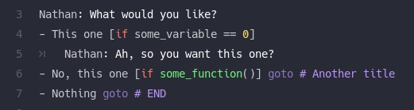
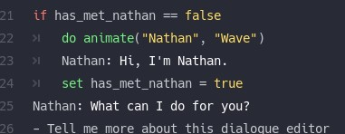

# Writing Dialogue

Navigate to the "Dialogue" tab in the editor.

Open some dialog by clicking the "new dialogue file" button or "open dialogue" button.

## Nodes

All dialog exist within nodes. A node is started with a line beginning with a "~ ".

A node will continue until another title is encountered or the end of the file.

## Dialog

A dialog line is either just text or in the form of "Character: What they say". Dialog lines can contain variables wrapped in "{{}}". Any variables you use must be a property or method on one of your provided game states (see down below under **Settings, Runtime**).

Dialog lines can also contain `bb_code` for RichTextEffects (if you end up using a `RichTextLabel` or the `DialogueLabel` provided by this addon).

If you use the `DialogueLabel` node then you can also make use of the `[wait=N]` and `[speed=N]` codes. `wait` will pause the typing of the dialog for `N` seconds (eg. `[wait=1.5]` will pause for 1.5 seconds). `speed` will change the typing speed of the current line of dialog by that factor (eg `[speed=10]` will change the typing speed to be 10 times faster than normal).

## Responses

To give the player branching options you can start a line with "- " and then a prompt.

By default responses will just continue on to the lines below the list when one is chosen.

To branch, you can provide and indented body under a given prompt or add a `=> Some title` where "Some title" is the title of another node. If you want to end the conversation right away you can `=> END`.

## Conditions

You can use conditional blocks to further branch. Start a condition line with "if" and then a comparison. You can compare variables or function results.

Additional conditions use "elif" and you can use "else" to catch any other cases.

Responses can also have conditions. Wrap these in "[" and "]".

If using a condition and a goto on a response line then make sure the goto is provided last.

## Mutations

You can modify state with either a "set" or a "do" line. Any variables or functions used must be a property or method on one of your provided game states (see down below under **Settings, Runtime**).

In the example above, the dialog manager would expect one of your game states to implement a method with the signature `func animate(string, string) -> void`

## Error checking

Running an error check should highlight any syntax or referential integrity issues with your dialog.

If a dialog resource has any errors on it at runtime it will throw an assertion failure and tell you which file it is.

## Running a test scene

For dialog that doesn't rely too heavily on game state conditions you can do a quick test of it by clicking the "Run the test scene" button in the main toolbar.

This will boot up a test scene and run the currently active node. Use `ui_up`, `ui_down`, and `ui_accept` to navigate the dialog and responses.

Once the conversation is over the scene will close.

## Translations

You can export tranlsations as CSV from the "Translations" menu in the dialog editor. 

This will find any unique dialog lines or response prompts and add them to a list. If a static key is specified for the line (eg. `[TR:SOME_KEY]`) then that will be used as the translation key, otherwise the dialog/prompt itself will be.

If the target CSV file already exists, it will be merged with it.
